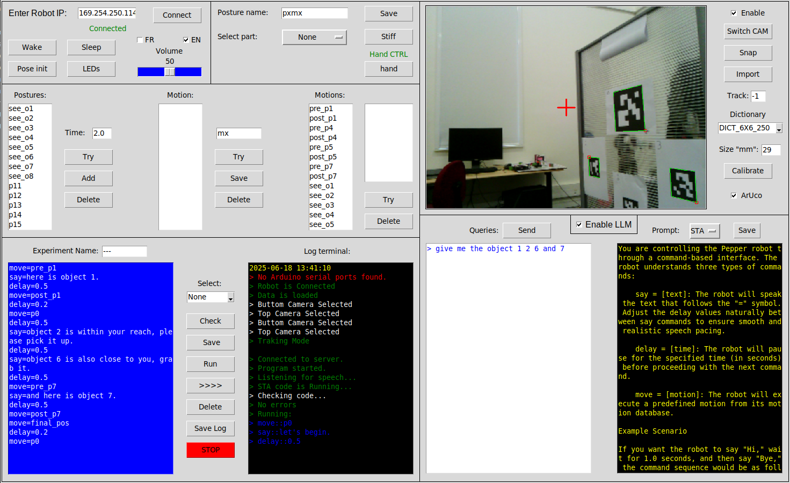

# PepperPilot


---

This Python-based GUI provides a comprehensive interface to control, program, and interact with the Pepper humanoid robot. It supports manual control, motion sequencing, natural language programming, vision processing, speech interaction, and integration with external hardware such as Arduino boards.

---

## Features

### Frame 0: Robot Connection and System Settings
- Connect to the robot, put it to sleep, or wake it up
- Set robot language for speech and interface
- Adjust volume levels for speech and system sounds

### Frame 1: Manual Robot Control and Posture Management
- Manual control of robot arms, head, torso, and knees
  - Arms: Set stiffness to 0 for manual movement, then stiffness to 1 to fix posture
  - Head, torso, knees: Controlled via keyboard arrow keys
- Save and name current postures to the database

### Frame 2: Motion Sequence Programming and Database Management
- Create motions by sequencing saved postures with adjustable durations (sets velocity)
- Preview motions before saving
- Add, edit, and delete postures and motions from the database

### Frame 3: Natural Language Programming Terminal

| **Command**           | **Description**                                                                 |
|-----------------------|---------------------------------------------------------------------------------|
| `say = "text"`        | Robot vocalizes the specified text                                             |
| `move = "motion"`     | Executes a predefined motion saved in the database                             |
| `say_pc = text`       | Local host (e.g., lab PC) vocalizes the specified text                         |
| `lookat_aruco = id`   | Robot looks once at the specified ArUco marker ID (requires Frame 4 enabled)   |
| `image = "file.png"`  | Displays the specified image on Pepper’s tablet (image must be uploaded)       |
| `image = list`        | Shows a list of available images from the `html` folder                        |
| `image = hide`        | Clears the Pepper tablet screen                                                |
| `delay = number`      | Pauses execution for the specified number of seconds                           |
| `break = true`        | Divides the script into segments; robot waits for manual resume                |

Additional Features:
- **Script Checker:** Validates syntax and database references before execution  
- **Script Manager:** Save, edit, and delete scripts by name  
- **Log Terminal:** Tracks GUI/robot events in real time; supports log file saving  
- **Arduino Integration:** On connection, prompts for serial port to sync external devices (e.g., Vicon, EEG)


### Frame 4: Vision and Camera Control
- Switch between Pepper’s two cameras
- Enable or disable vision processing features
- Capture snapshots and import images for experiments or calibration
- Enable/disable ArUco marker detection; configure marker size and dictionary
- Specify ArUco marker ID for continuous tracking (default is no tracking)

### Frame 5: Speech and AI-Based Interaction
- Enable/disable AI modules for speech-to-action (STA) and short-term memory (STM) powered by large language models
- Configure AI prompt templates for STA and STM
- Speech terminal for sending natural language commands to the robot
- Requires API key setup (e.g., MyStral API) for LLM integration

---

## Additional Information

- Postures, motions, and scripts are stored locally in a database for persistent use.
- Commands and motions are validated automatically before execution to reduce errors.
- Arduino board support enables synchronization of experiments through serial communication.
- Designed for research labs to facilitate humanoid robot interaction and experimental control.

---

### Images on Pepper's Tablet

To display a new image on Pepper’s tablet via the GUI, follow these steps:

1. Place the image in the folder: `data/images/tablet/html`.
2. Run the associated **Choregraphe behavior** included in the project to upload the image to the robot.
3. Use the `image = "filename.png"` command in the Natural Language Programming Terminal (Frame 3) to display the image on the tablet.

> ⚠️ Make sure the image filename matches exactly, including extension, and that the robot is connected when uploading.

---

# NAOqi SDK Setup and Python Environment Configuration on Linux
### ⚠️This GUI has been tested on Ubuntu 20.04, where it runs in a stable way. Using a different Ubuntu version might lead to compatibility issues with the NAOqi SDK.

## 1. Install Required Build Dependencies

```bash
sudo apt update
sudo apt install -y build-essential zlib1g-dev libncurses5-dev \
libgdbm-dev libnss3-dev libssl-dev libreadline-dev libffi-dev \
wget curl libsqlite3-dev xz-utils tk-dev
```

---

## 2. Install Python 2.7 from Source

```bash
cd /usr/src
sudo wget https://www.python.org/ftp/python/2.7.18/Python-2.7.18.tgz
sudo tar xzf Python-2.7.18.tgz
cd Python-2.7.18
sudo ./configure --enable-optimizations
sudo make altinstall
```

---

## 3. Install Python 3.10

```bash
sudo add-apt-repository ppa:deadsnakes/ppa
sudo apt update
sudo apt install python3.10
```

* Python 3.10 will be available as: `/usr/bin/python3.10`

---

## 4. Make Python 2.7 the Default `python` Command

```bash
sudo ln -sf /usr/local/bin/python2.7 /usr/bin/python
```

### Verify:

```bash
python --version      # Should show Python 2.7.18
python3 --version     # Should show Python 3.10.x
```

---

## 5. NAOqi SDK Python 2.7 Installation and Setup

### 5.1 Locate the SDK Folder

Example path:

```
/home/pepper/pynaoqi-python2.7-2.8.7.4-linux64-20210819_141148
```

### 5.2 Find the Python Module Path

```
/home/pepper/pynaoqi-python2.7-2.8.7.4-linux64-20210819_141148/lib/python2.7/site-packages
```

### 5.3 Set the `PYTHONPATH` Environment Variable

Temporarily:

```bash
export PYTHONPATH=/home/pepper/pynaoqi-python2.7-2.8.7.4-linux64-20210819_141148/lib/python2.7/site-packages:$PYTHONPATH
```

Permanently (recommended):

```bash
echo 'export PYTHONPATH=/home/pepper/pynaoqi-python2.7-2.8.7.4-linux64-20210819_141148/lib/python2.7/site-packages:$PYTHONPATH' >> ~/.bashrc
source ~/.bashrc
```

### 5.4 Verify the Installation

```bash
python2.7
>>> import naoqi
```

If no error occurs, NAOqi SDK is ready.

---

## 6. System Dependencies for GUI Application

Install required system libraries:

```bash
sudo apt-get install libespeak1 libportaudio2 libportaudiocpp0 portaudio19-dev python3.10-dev
```

---

## 7. Required Python Packages

### For Python 2.7:

```bash
pip2 install pyttsx3==2.6
```

### For Python 3.10:

```bash
pip install opencv-python==3.4.9.31 opencv-contrib-python==3.4.9.31 Pillow pyserial
python3.10 -m pip install SpeechRecognition sounddevice mistralai PyAudio
```

---

## ✅ Final Notes

* Make sure `pip`, `pip2`, and `pip3` are properly installed.
* Use virtual environments if needed to avoid conflicts between Python versions.
* Check audio device permissions if you encounter microphone-related issues with `SpeechRecognition` or `sounddevice`.

---

## License

This project is licensed under the [MIT License](LICENSE).

---

## Contact

For questions or contributions, please contact:  
**Ahmad Kaddour / INSERM U1093, FRANCE**  
Email: ahmad.kaddour@inserm.fr  
Repository: https://github.com/Ahmad-k95

